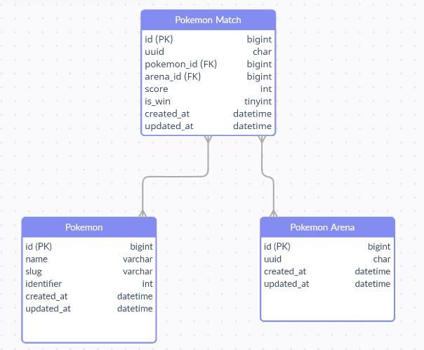

## Tech
1. Python (Django Rest Framework)
2. MySQL

## How to run
1. Create your virtual env or used your global env and actived your env
   ```
    your_path_env/Scripts
    activate
   ```
2. Install lib
   ```
    pip install -r requirements.txt
   ```
3. Prepare your database (create new database) and adjust `farmacare/settings` file for the database settings
4. run migrate
   ```
   python manage.py migrate
   ```
5. run command for pokemon data
   ```
   python manage.py get_and_create_pokemon_data
   ```
6. run server
   ```
   python manage.py runserver
   ```

## Entity Diagram


## Endpoints
base URL
    ```
    localhost:8000/api/
    ```

1. [GET] `pokedex/` -> Get results pokedex and count pokemon
2. [GET] `pokemon/` -> Get Results of pokemon
3. [POST] `matches/` -> Post match pokemon <br />
   JSON body
   ```
    [
      {
        "pokemon": "bulbasaur",
        "score": 3
      },
      {
        "pokemon": "ivysaur",
        "score": 1
      },
      {
        "pokemon": "venusaur",
        "score": 4
      },
      {
        "pokemon": "metapod",
        "score": 2
      },
      {
        "pokemon": "caterpie",
        "score": 2
      }
    ]
   ```
4. [GET] `pokemon-matches/` -> Get Results of matches
5. [POST] `matches/<uuid>/` -> Update pokemon in match <br />
   JSON body
   ```
   You can take uuid from the match arena (pokemon-matches/)
   
   {
   "pokemon": "bulbasaur",
   "score": 4,
   "winner": true
   }
   ```
